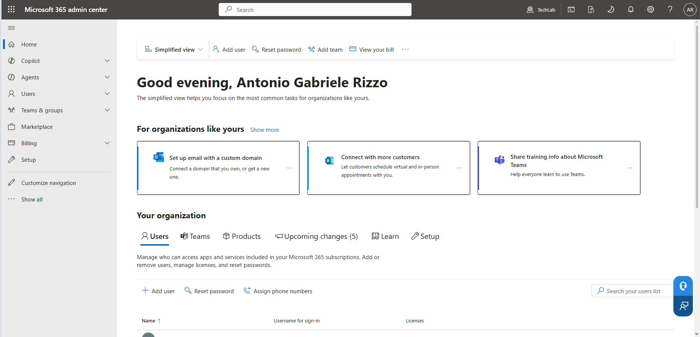
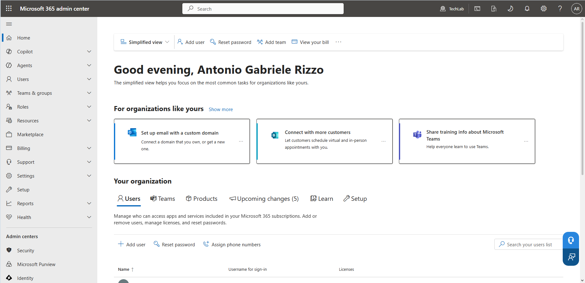
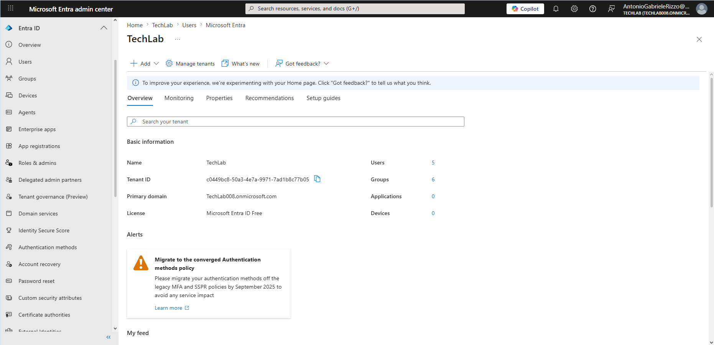
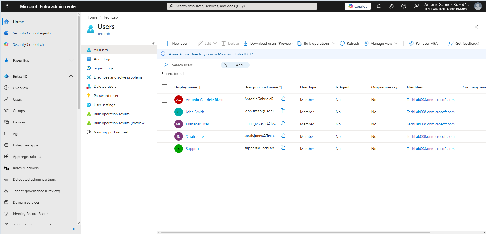

# 01 - Identity Overview

## Introduction

Microsoft Entra ID (formerly Azure Active Directory) is Microsoft's cloud-based Identity and Access Management (IAM) platform.

It provides organisations with a central location to manage users, groups, authentication, security, and access to cloud resources.

Microsoft Entra ID is a core component of Microsoft 365 and is widely used in modern cloud-first environments.

This chapter introduces the Microsoft Entra Admin Center, explains fundamental identity concepts, and familiarises the reader with the administrative portal before performing hands-on administration tasks in later chapters.

---

## Objectives

After completing this chapter, you should be able to:

- Explain the purpose of Microsoft Entra ID
- Access the Microsoft Entra Admin Center
- Navigate the Microsoft Entra portal
- Locate key identity management areas
- Understand the role of users and groups
- Explain the difference between authentication and authorisation
- Understand the relationship between Microsoft Entra ID and Active Directory

---

## Prerequisites

Before starting this chapter, ensure you have:

- A Microsoft 365 tenant
- Administrative access to the tenant
- Access to Microsoft Entra Admin Center
- A web browser

---

# Accessing Microsoft Entra Admin Center

Microsoft Entra Admin Center can be accessed directly or through Microsoft 365 Admin Center.

## Method 1 - Microsoft 365 Admin Center

Navigate to:

```text
https://admin.microsoft.com
```

Sign in using an administrative account.

The Microsoft 365 Admin Center is the primary management portal for Microsoft 365 services.

### Microsoft 365 Admin Center Home Page

The first step is to access the Microsoft 365 Admin Center.



---

### Expanding the Administration Menu

Select:

```text
Show all
```

to expand the navigation menu.

This reveals additional Microsoft administration portals, including Microsoft Entra ID.



---

### Opening Microsoft Entra Admin Center

After expanding the menu:

1. Locate **Identity**
2. Select **Identity**
3. Microsoft Entra Admin Center opens in a new browser tab

---

## Method 2 - Direct Access

Microsoft Entra Admin Center can also be accessed directly by navigating to:

```text
https://entra.microsoft.com
```

and signing in with an account that has the appropriate permissions.

---

# Microsoft Entra Overview

The Overview page provides a high-level summary of the tenant and serves as the starting point for identity administration.

The page displays information such as:

- Tenant name
- Tenant ID
- Primary domain
- Licence information
- User count
- Group count
- Device count



---

# Understanding the Navigation Menu

The navigation menu provides access to the various administration areas within Microsoft Entra ID.

Some of the most important sections for entry-level IT support and administration roles include:

## Users

Used to:

- Create users
- Modify user properties
- Reset passwords
- Disable accounts
- Delete users

## Groups

Used to:

- Create groups
- Manage memberships
- Control access to resources

## Devices

Used to:

- View registered devices
- Manage device identities

## Enterprise Applications

Used to:

- Manage cloud applications
- Review application access

## App Registrations

Used by developers and administrators to integrate applications with Microsoft Entra ID.

## Roles & Admins

Used to:

- Assign administrative roles
- Delegate permissions
- Implement least privilege principles

The navigation menu shown in the Overview page provides quick access to these areas.

---

# Users Overview

Users are the primary identity objects managed within Microsoft Entra ID.

Most day-to-day Service Desk and IT Support activities involve user administration.

Examples include:

- Creating users
- Password resets
- Account unlocks
- Group membership changes
- User onboarding
- User offboarding

The Users section provides administrators with tools to perform these tasks.



---

# Identity Management Concepts

Identity Management is the process of managing digital identities and controlling access to resources.

Examples of identities include:

- Employees
- Contractors
- Students
- Service accounts

Microsoft Entra ID allows organisations to manage these identities securely from a central platform.

---

# Authentication vs Authorisation

These two concepts are frequently confused but serve different purposes.

## Authentication

Authentication answers the question:

> Who are you?

Examples:

- Username and password
- Multi-Factor Authentication (MFA)
- Windows Hello
- Microsoft Authenticator

Authentication verifies the identity of a user.

## Authorisation

Authorisation answers the question:

> What are you allowed to access?

Examples:

- Group memberships
- Administrative roles
- SharePoint permissions
- Microsoft Teams permissions

Authorisation determines which resources a user can access after authentication has been completed successfully.

---

# Microsoft Entra ID vs Active Directory

Although they share similar objectives, Microsoft Entra ID and Active Directory are different technologies.

| Active Directory | Microsoft Entra ID |
|-----------------|-------------------|
| Primarily on-premises | Cloud-based |
| Windows Server dependent | Microsoft cloud service |
| Domain-based authentication | Modern cloud authentication |
| Group Policy management | Cloud identity management |
| Traditional enterprise environments | Cloud-first environments |

Many organisations use both technologies together in hybrid environments.

For entry-level IT roles, it is important to understand that Microsoft Entra ID is the modern cloud identity platform while Active Directory remains common in traditional on-premises infrastructures.

---

# Key Takeaways

- Microsoft Entra ID is Microsoft's cloud identity and access management platform.
- Microsoft Entra Admin Center can be accessed through Microsoft 365 Admin Center or directly through the Entra portal.
- Users and groups are core identity objects.
- Authentication verifies identity.
- Authorisation determines access.
- Microsoft Entra ID is widely used in modern cloud-first environments.
- Understanding Entra ID is an important skill for IT Support and Service Desk professionals.

---

# Skills Developed

By completing this chapter, the following skills were developed:

- Microsoft Entra navigation
- Identity and Access Management (IAM) fundamentals
- Cloud identity concepts
- Authentication and authorisation concepts
- Administrative portal familiarisation
- Technical documentation
- Microsoft cloud administration fundamentals
