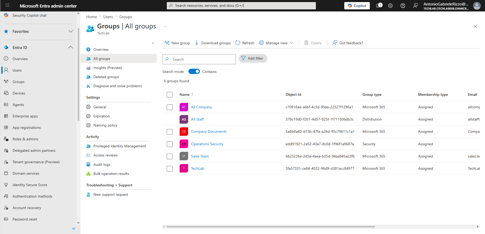
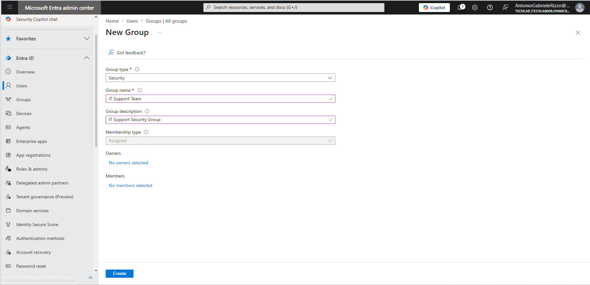
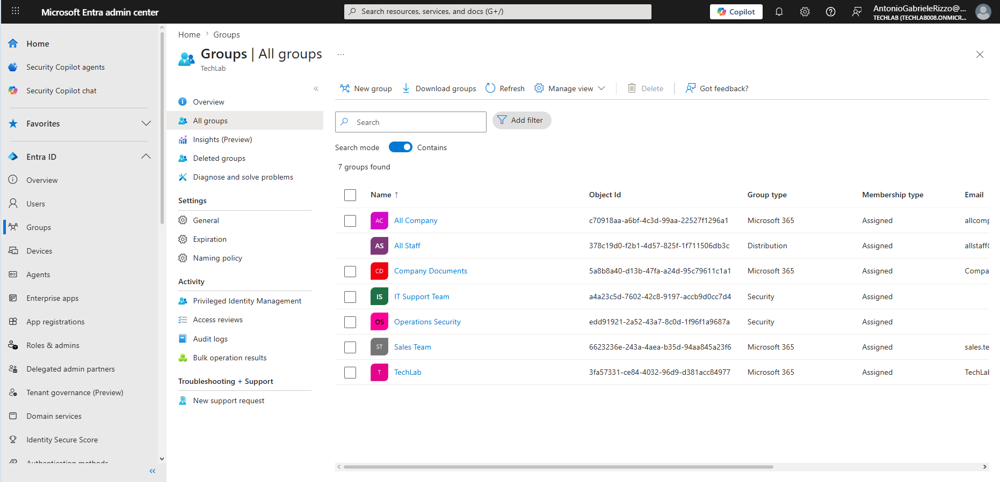
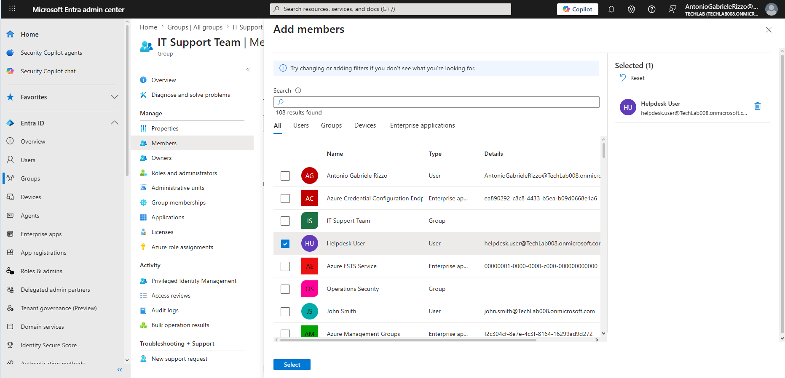
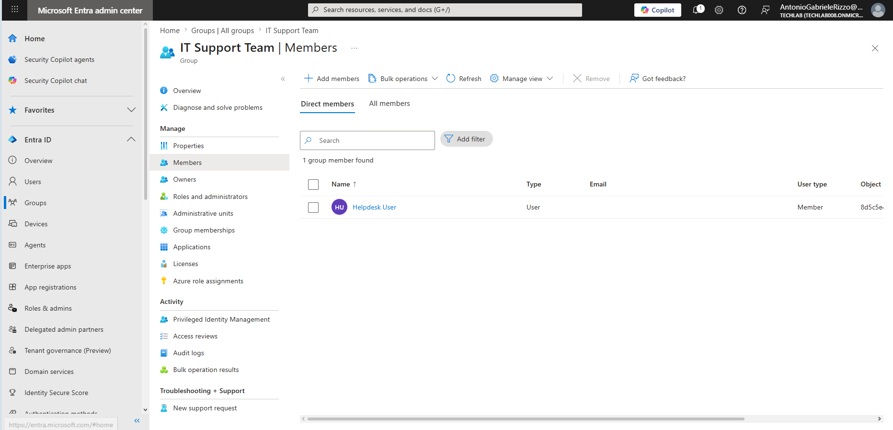
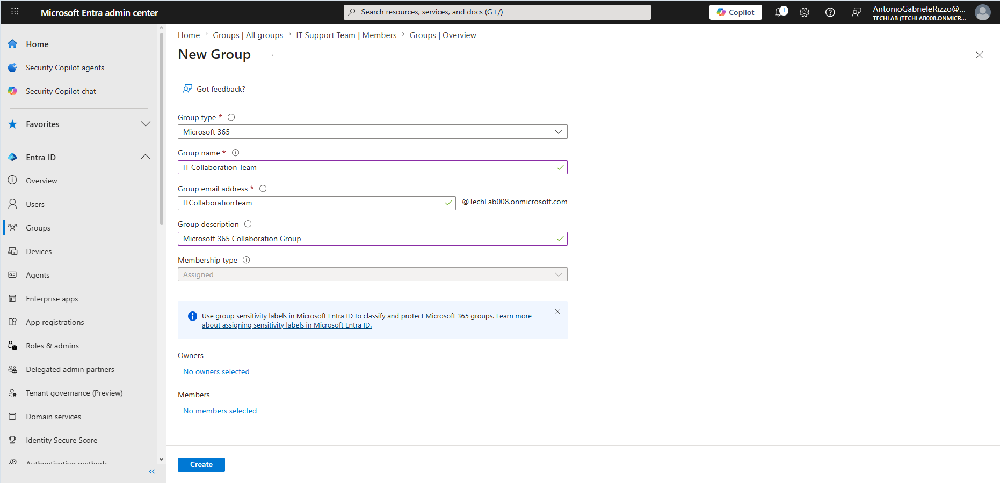
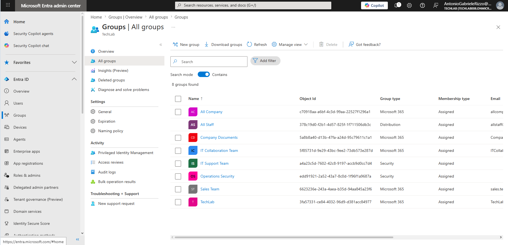
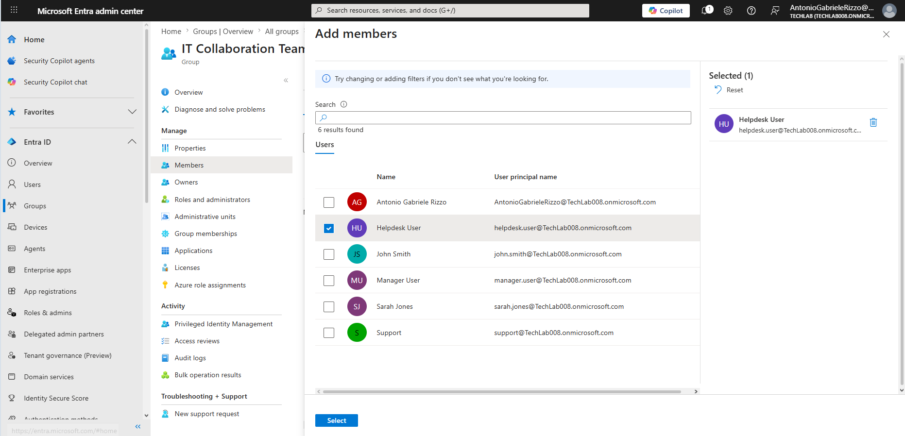
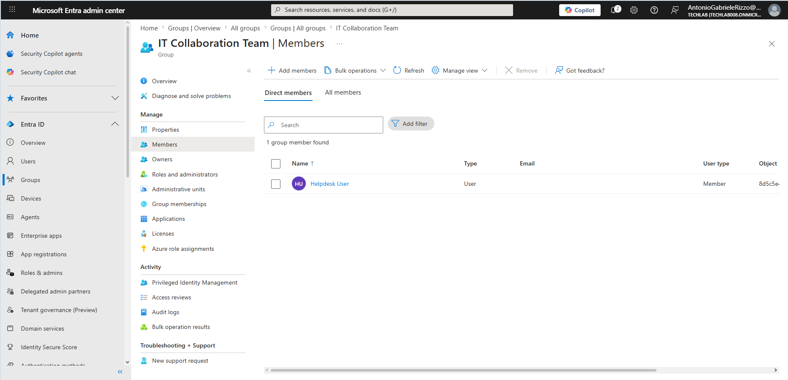
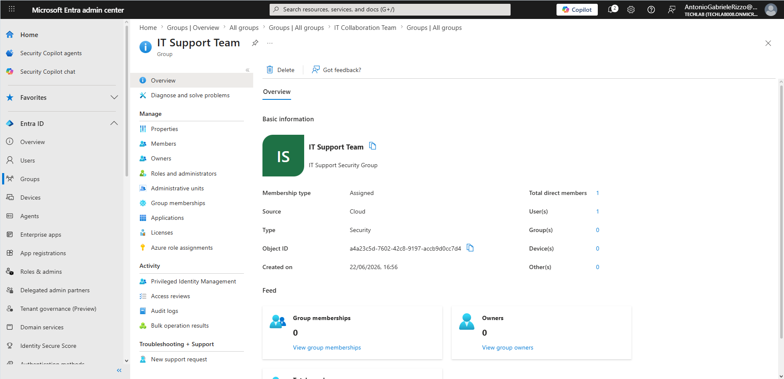

# 03 - Group Management

## Introduction

Groups are used in Microsoft Entra ID to simplify administration and manage access efficiently.

Instead of assigning permissions individually to users, administrators can assign permissions to groups and manage membership centrally.

This chapter demonstrates how to create and manage Security Groups and Microsoft 365 Groups, as well as how to add users to group memberships.

---

## Objectives

- View existing groups
- Create a Security Group
- Add members to a Security Group
- Create a Microsoft 365 Group
- Add members to a Microsoft 365 Group
- Review group properties and memberships

---

## Prerequisites

- Access to Microsoft Entra Admin Center
- Administrative permissions
- Existing user account (Helpdesk User)

---

# Viewing Existing Groups

## Navigation

Identity → Groups → All Groups

---

# Creating a Security Group

## Navigation

Groups → New Group

Configuration:

- Group Type: Security
- Group Name: IT Support Team
- Description: IT Support Security Group

---

# Verifying Security Group Creation

---

# Adding a Member to the Security Group

Navigation:

Groups → IT Support Team → Members → Add Members

Select:

Helpdesk User

---

# Verifying Security Group Membership

---

# Creating a Microsoft 365 Group

Configuration:

- Group Type: Microsoft 365
- Group Name: IT Collaboration Team
- Description: Microsoft 365 Collaboration Group

---

# Verifying Microsoft 365 Group Creation

---

# Adding a Member to the Microsoft 365 Group

Navigation:

Groups → IT Collaboration Team → Members → Add Members

Select:

Helpdesk User

---

# Verifying Microsoft 365 Group Membership

---

# Reviewing Group Properties

---

# Administrative Best Practices

- Use groups instead of assigning permissions directly to users
- Review memberships regularly
- Follow least privilege principles
- Assign owners where appropriate
- Remove inactive members

---

# Key Learnings

- Security Group creation
- Microsoft 365 Group creation
- Membership management
- Group administration
- Access management

---

# Skills Developed

- Group Administration
- Identity Management
- Access Management
- Microsoft Entra Administration
- Membership Management
- Technical Documentation

---

# Chapter Summary

This chapter demonstrated how to create and manage Security Groups and Microsoft 365 Groups, add members, and review group configuration within Microsoft Entra ID.
