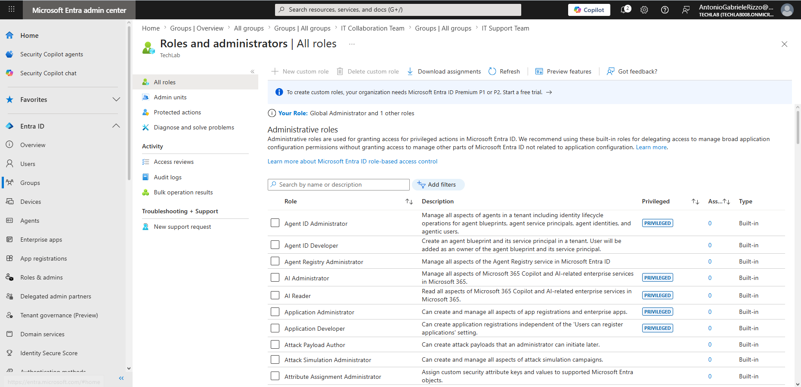
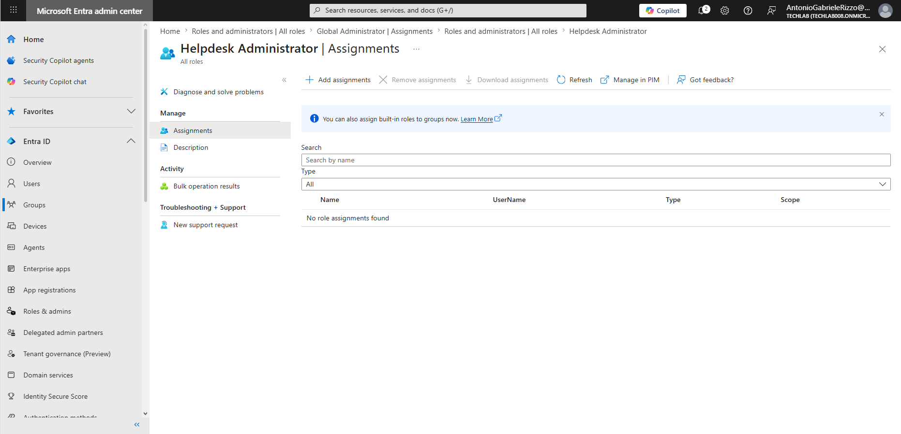
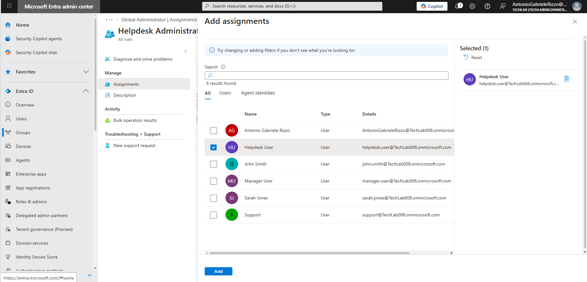
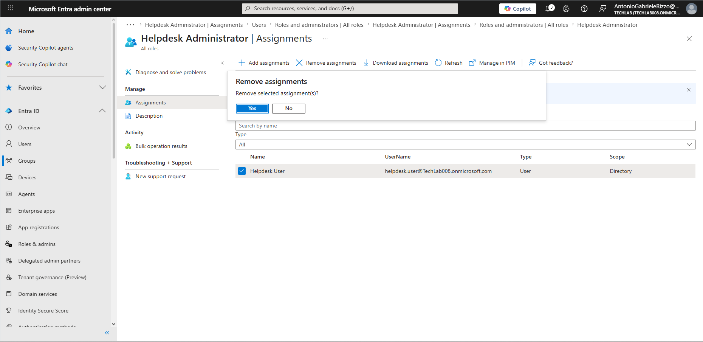
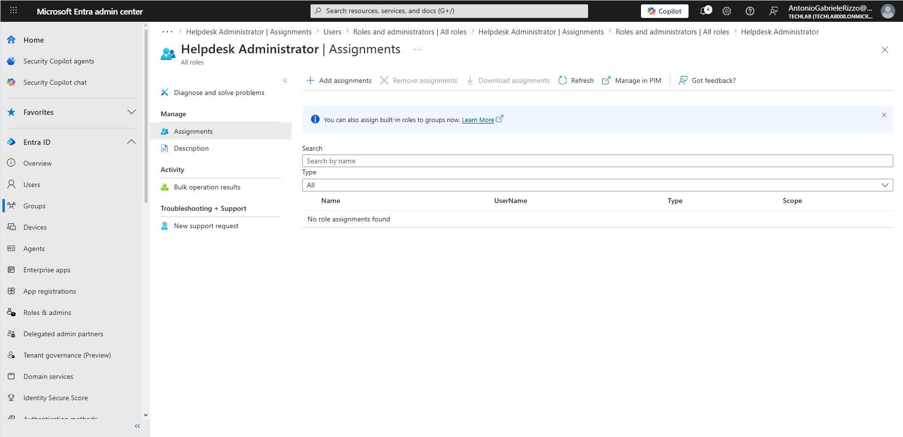
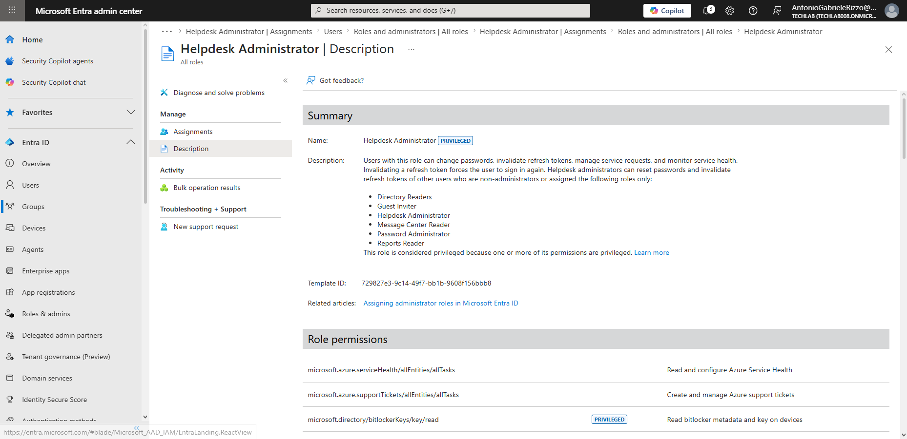

# 04 - Introduction to Administrative Roles

## Introduction

Microsoft Entra ID uses administrative roles to delegate permissions and administrative responsibilities across the tenant.

Rather than granting every administrator full Global Administrator permissions, Microsoft Entra ID provides built-in roles that follow the Principle of Least Privilege.

---

## Objectives

- Understand Microsoft Entra administrative roles
- Review built-in administrator roles
- Assign administrative roles to users
- Remove administrative role assignments
- Apply the Principle of Least Privilege

---

# Reviewing Available Administrative Roles

## Navigation

Identity → Roles & administrators

---

# Global Administrator Role

Search for Global Administrator and review the role.

This screenshot demonstrates both the role overview and current role assignments.

---

# Reviewing the Helpdesk Administrator Role

Search for Helpdesk Administrator and review the role.

---

# Assigning an Administrative Role

Helpdesk Administrator → Assignments → Add assignments

Select Helpdesk User.

---

# Verifying Role Assignment

---

# Removing an Administrative Role

Select Helpdesk User and choose Remove assignments.

---

# Verifying Role Removal

---

# Reviewing Role Permissions

Helpdesk Administrator → Description

---

# Principle of Least Privilege

Administrative permissions should be assigned only when required and removed when no longer needed.

This chapter demonstrated assigning, validating, removing, and verifying removal of an administrative role.

---

# Skills Developed

- Role-Based Access Control (RBAC)
- Administrative Role Management
- Microsoft Entra Administration
- Security Administration
- Identity Management

---

# Chapter Summary

- Reviewed administrative roles
- Examined Global Administrator permissions
- Reviewed Helpdesk Administrator permissions
- Assigned a role to a user
- Removed the role assignment
- Applied the Principle of Least Privilege
