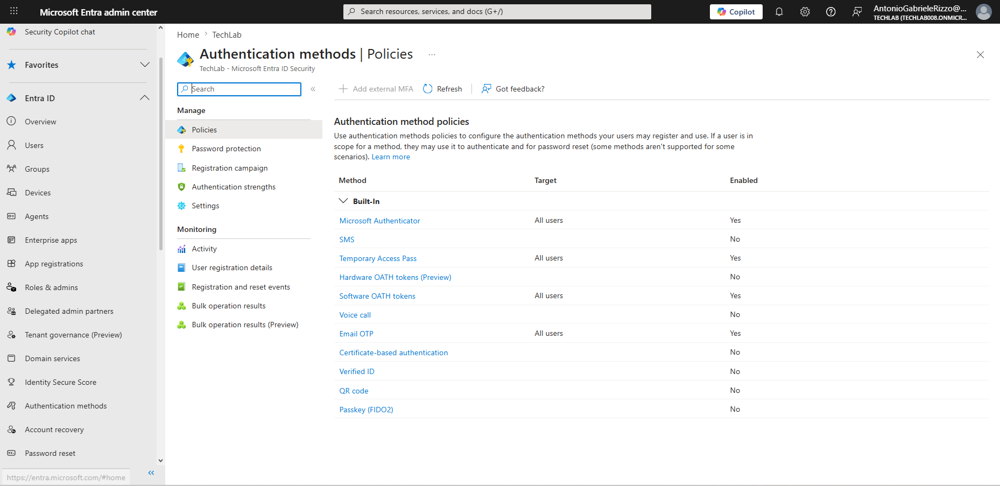
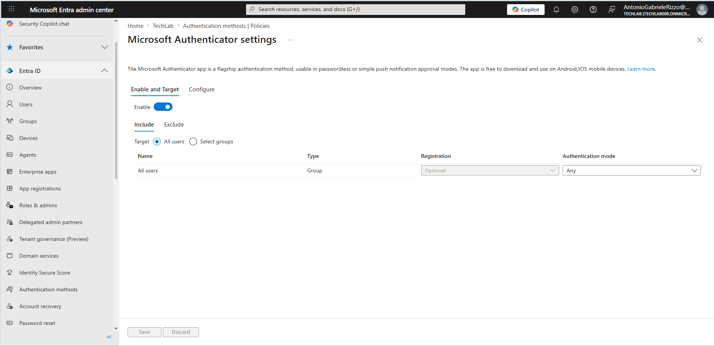
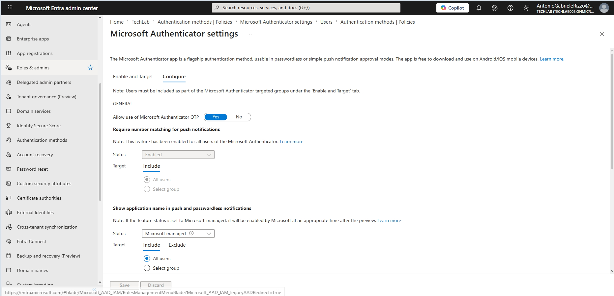
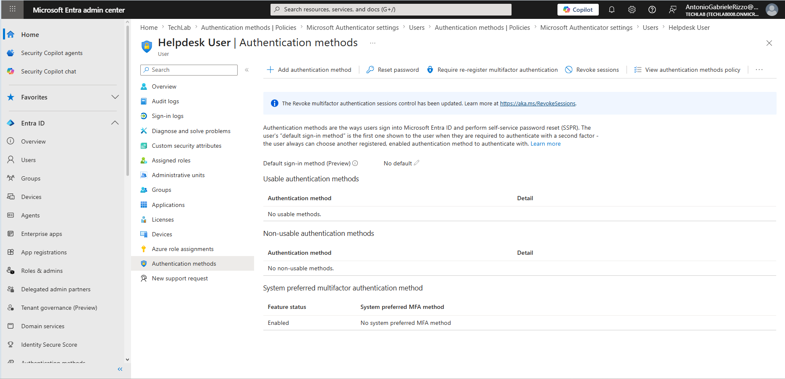
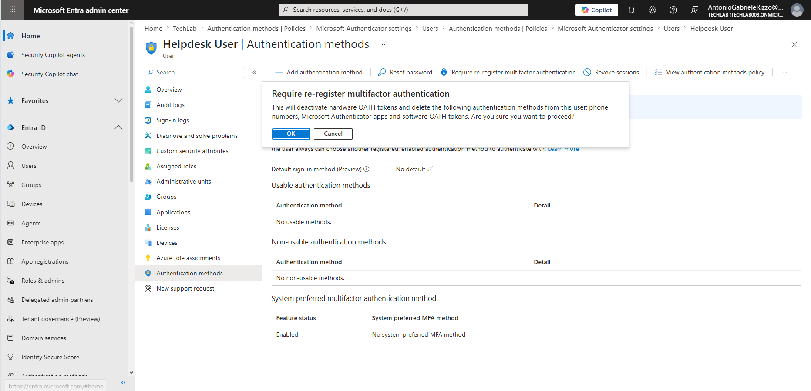
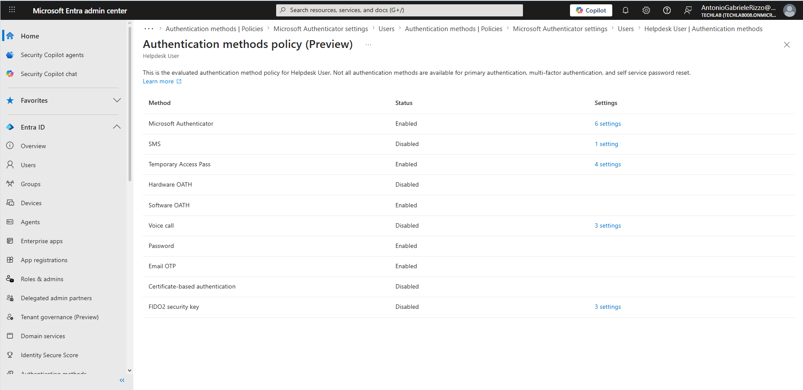

# 05 - Multi-Factor Authentication (MFA)

## Introduction

Multi-Factor Authentication (MFA) is one of the most important security controls available in Microsoft Entra ID. Traditional authentication relies on a username and password, but passwords can be compromised through phishing attacks, credential reuse, malware, social engineering, or data breaches.

MFA strengthens security by requiring users to provide an additional verification factor before access is granted. Even if a password is compromised, the attacker must still satisfy another authentication requirement.

Microsoft Entra ID supports multiple authentication methods including Microsoft Authenticator, Temporary Access Pass, Software OATH Tokens, FIDO2 Security Keys, Email OTP, SMS, and Voice Call authentication.

In this chapter, authentication method policies were reviewed, Microsoft Authenticator settings were examined, user authentication methods were analysed, and MFA administration tasks were explored within Microsoft Entra ID.

---

## Objectives

After completing this chapter, you should be able to:

- Understand Multi-Factor Authentication concepts
- Understand authentication factors
- Review authentication method policies
- Configure authentication methods
- Review Microsoft Authenticator settings
- Manage user authentication methods
- Require MFA re-registration
- Review effective authentication method policies
- Apply authentication security best practices

---

## Prerequisites

Before starting this chapter:

- Access to Microsoft Entra Admin Center
- Administrative permissions
- Existing test users
- Microsoft Entra ID tenant
- Completed Chapters 01–04

---

# Understanding Multi-Factor Authentication

Multi-Factor Authentication requires users to verify their identity using two or more authentication factors.

Authentication factors are generally divided into three categories.

## Something You Know

Examples:

- Password
- PIN
- Security questions

## Something You Have

Examples:

- Mobile phone
- Microsoft Authenticator application
- Hardware security key
- OATH token

## Something You Are

Examples:

- Fingerprint
- Facial recognition
- Biometric authentication

MFA combines factors from different categories to provide stronger protection than passwords alone.

---

# Benefits of Multi-Factor Authentication

MFA provides several important security benefits.

### Improved Security

Even if a password is compromised, attackers must still satisfy another authentication factor.

### Reduced Risk of Phishing

Modern authentication methods such as Microsoft Authenticator provide protection against many phishing attacks.

### Compliance Support

Many organisations require MFA to meet security and compliance requirements.

### Protection Against Password Reuse

Users frequently reuse passwords across services. MFA reduces the impact of exposed credentials.

---

# Authentication Methods in Microsoft Entra ID

Microsoft Entra ID supports several authentication methods including:

- Microsoft Authenticator
- Temporary Access Pass
- Software OATH Tokens
- Email One-Time Passcode (OTP)
- FIDO2 Security Keys
- Certificate-Based Authentication
- SMS Authentication
- Voice Call Authentication

Authentication methods can be enabled, disabled, and targeted to users through Authentication Method Policies.

---

# Reviewing Authentication Method Policies

## Navigation

Authentication methods → Policies

The Authentication Methods page provides a central location for managing authentication methods available within the tenant.

Administrators can review:

- Available methods
- Target users
- Enabled methods
- Disabled methods
- Policy configuration

---

# Microsoft Authenticator Policy

Microsoft Authenticator is Microsoft's primary MFA application and one of the most commonly used authentication methods.

It supports:

- Push notifications
- Number matching
- Device verification
- Passwordless sign-in

## Navigation

Authentication methods → Policies → Microsoft Authenticator

The policy page allows administrators to review how Microsoft Authenticator is deployed within the tenant.

---

# Reviewing Microsoft Authenticator Configuration

Additional settings are available through the configuration page.

## Navigation

Microsoft Authenticator → Configure

Configuration options may include:

- Authentication modes
- Registration requirements
- User targeting
- Passwordless authentication settings

These settings help organisations align authentication methods with security requirements.

---

# User Authentication Methods

Authentication methods can also be reviewed at the individual user level.

## Navigation

Users → Helpdesk User → Authentication methods

This page displays:

- Registered authentication methods
- Default sign-in method
- MFA administration actions
- User-specific authentication settings

This page is frequently used when troubleshooting authentication issues.

---

# Requiring MFA Re-Registration

Administrators may occasionally need to require users to register their authentication methods again.

Common scenarios include:

- Lost mobile device
- New mobile device
- Security incident
- Compromised authentication method
- Incorrect registration

## Navigation

Helpdesk User → Authentication methods → Require re-register multifactor authentication

This action forces the user to complete the MFA registration process again during their next sign-in.

---

# Reviewing Effective Authentication Method Policies

Microsoft Entra evaluates authentication method policies for individual users.

## Navigation

Helpdesk User → Authentication methods → View authentication methods policy

This page displays the effective authentication methods available to the selected user.

Examples include:

- Microsoft Authenticator
- Temporary Access Pass
- Software OATH
- Password
- Email OTP

This helps administrators understand which authentication methods are available to a user.

---

# Passwordless Authentication Overview

Microsoft Entra ID supports passwordless authentication technologies designed to improve both security and user experience.

Examples include:

- Microsoft Authenticator Passwordless Sign-In
- FIDO2 Security Keys
- Windows Hello for Business

Benefits include:

- Reduced phishing risk
- Elimination of password reuse
- Improved user experience
- Stronger identity protection

Passwordless authentication is becoming increasingly important in modern identity management.

---

# Security Best Practices

When implementing MFA:

- Enable MFA for all users whenever possible
- Prefer application-based authentication methods
- Review authentication methods regularly
- Remove unused methods
- Support passwordless authentication where appropriate
- Educate users about phishing and MFA fatigue attacks

---

# Key Learnings

This chapter demonstrated:

- Multi-Factor Authentication concepts
- Authentication factors
- Authentication method policies
- Microsoft Authenticator configuration
- User authentication methods
- MFA re-registration
- Authentication policy evaluation
- Passwordless authentication awareness
- Security best practices

---

# Skills Developed

By completing this chapter, the following skills were developed:

- Identity Security
- Multi-Factor Authentication Administration
- Authentication Method Management
- Microsoft Entra Administration
- Security Administration
- Access Management
- Technical Documentation
- GitHub Documentation

---

# Chapter Summary

In this chapter, Multi-Factor Authentication administration was explored within Microsoft Entra ID.

The following tasks were completed:

- Reviewed Authentication Method Policies
- Examined Microsoft Authenticator settings
- Reviewed authentication method configuration
- Examined user authentication methods
- Explored MFA re-registration procedures
- Evaluated user authentication method policies
- Reviewed passwordless authentication concepts
- Applied authentication security best practices

Multi-Factor Authentication is one of the most effective identity security controls available and forms a critical component of modern cloud security strategies.

Understanding how to configure, manage, and troubleshoot MFA is an essential skill for Microsoft 365 Administrators, Identity Administrators, Security Administrators, and Service Desk professionals.
