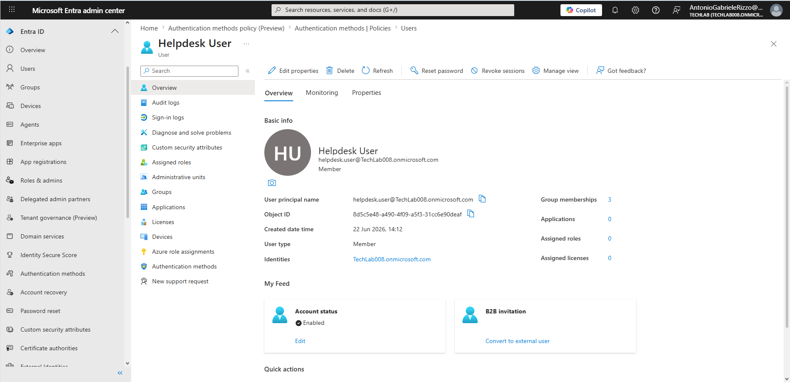
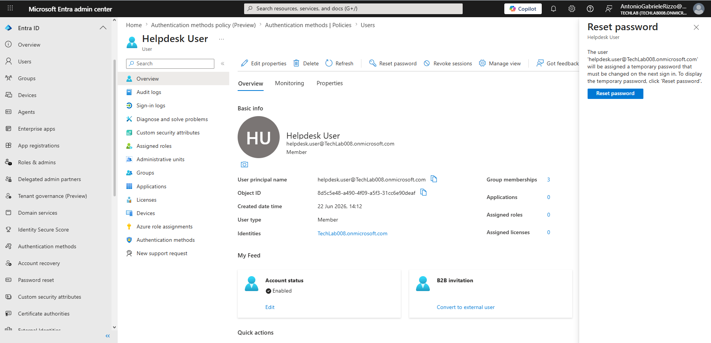
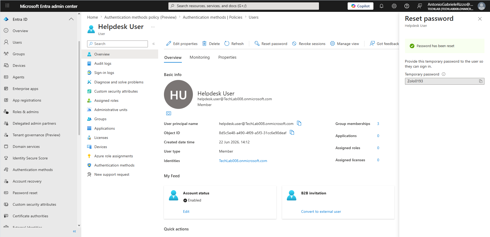
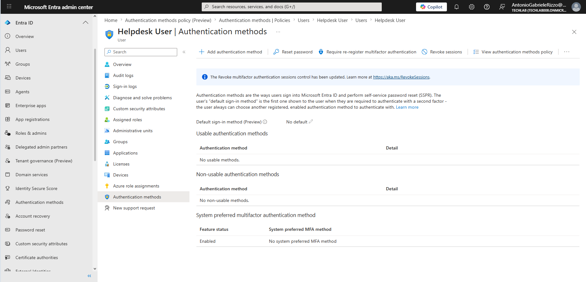
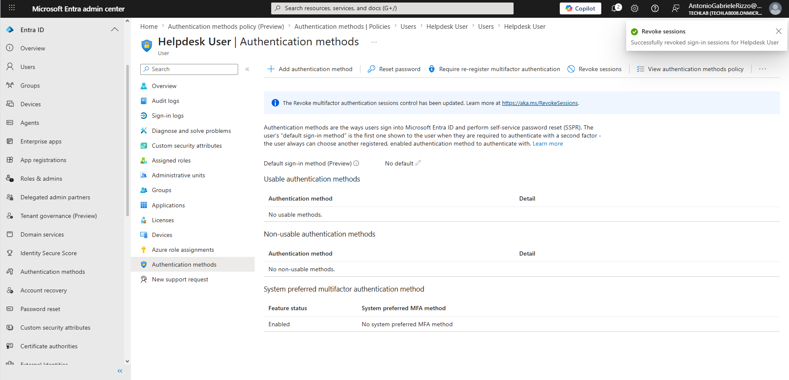
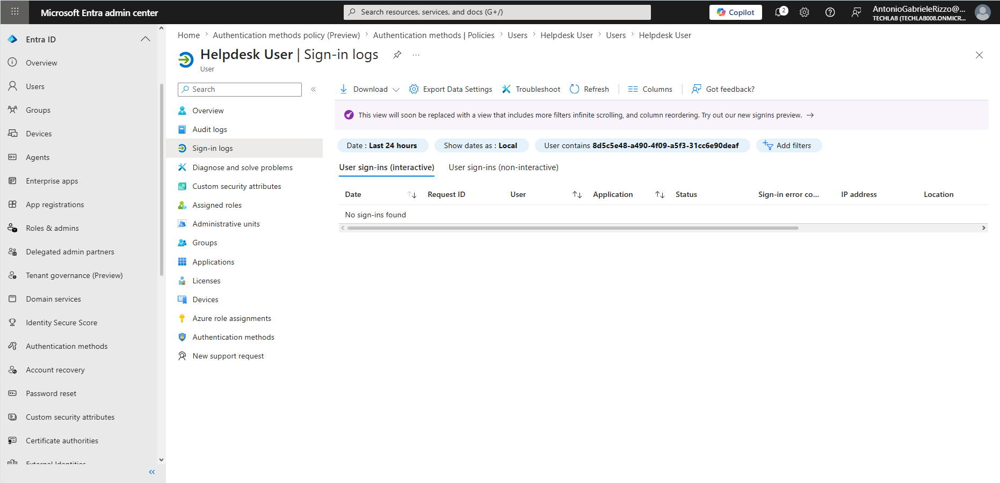

# 06 - Password Management

## Introduction

Password management is a core responsibility of Microsoft Entra ID administrators and Service Desk professionals. User accounts frequently require password resets, account recovery assistance, session revocation, and authentication troubleshooting.

Effective password management helps maintain account security while ensuring users can regain access to organisational resources when authentication issues occur.

In this chapter, password administration tasks were performed using Microsoft Entra ID, including password resets, temporary password generation, session revocation, authentication method review, and sign-in log analysis.

---

## Objectives

After completing this chapter, you should be able to:

- Perform password reset operations
- Understand temporary password usage
- Force password changes at next sign-in
- Review user authentication methods
- Revoke active user sessions
- Investigate sign-in activity
- Apply password security best practices
- Support account recovery procedures

---

## Prerequisites

- Access to Microsoft Entra Admin Center
- Administrative permissions
- Existing test users
- Microsoft Entra ID tenant
- Completed Chapters 01–05

---

# Password Management Overview

Password administration is one of the most common tasks performed by IT Support and Identity Administrators.

Common activities include:

- Password resets
- Account recovery
- Temporary password generation
- Session revocation
- Authentication troubleshooting
- User support

---

# Reviewing the User Account

## Navigation

Users → Helpdesk User

The user overview page provides administrators with access to:

- Account information
- Password management actions
- Authentication methods
- Sign-in logs
- Session management options

This page acts as the central location for user administration tasks.

---

# Initiating a Password Reset

## Navigation

Users → Helpdesk User → Reset password

Microsoft Entra ID allows administrators to generate a temporary password for a user account.

The user will be required to change this password during their next successful sign-in.

This process is commonly used when:

- Users forget their password
- Accounts become inaccessible
- Service Desk assistance is required

---

# Password Reset Results

After selecting Reset Password, Microsoft Entra ID generates a temporary password.

The generated password should be securely communicated to the user using approved organisational procedures.

Security considerations:

- Temporary passwords should never be shared publicly.
- Passwords should be changed immediately after sign-in.
- Users should create strong replacement passwords.

---

# Reviewing Authentication Methods

## Navigation

Users → Helpdesk User → Authentication methods

The Authentication Methods page allows administrators to review:

- Registered authentication methods
- MFA settings
- Password reset options
- Session management actions
- Authentication policy evaluation

This page is commonly used during account recovery and authentication troubleshooting activities.

---

# Revoking Active User Sessions

User sessions can be revoked when there is concern about account security or after a password reset has been performed.

Common scenarios include:

- Lost devices
- Suspected account compromise
- Password resets
- Security incidents

## Navigation

Users → Helpdesk User → Authentication methods → Revoke sessions

The action immediately invalidates active authentication sessions and requires the user to authenticate again.

This helps ensure that previously issued authentication tokens can no longer be used.

---

# Reviewing User Sign-In Logs

## Navigation

Users → Helpdesk User → Sign-in logs

Sign-in logs are an important troubleshooting and security monitoring tool.

Administrators can use sign-in logs to:

- Review authentication activity
- Investigate account access issues
- Identify failed sign-ins
- Review successful authentication attempts
- Support security investigations

In this lab environment, no sign-in activity was recorded during the selected time period.

---

# Password Security Best Practices

When managing passwords, administrators should follow established security practices.

### Use Strong Passwords

Encourage passwords that are difficult to guess and resistant to brute-force attacks.

### Reset Passwords Securely

Temporary passwords should only be shared through approved communication channels.

### Revoke Sessions After Security Events

Revoking active sessions reduces the risk of unauthorised access following account compromise.

### Support MFA

Multi-Factor Authentication should be enabled whenever possible to strengthen account security.

### Monitor Authentication Activity

Regular review of sign-in logs helps identify unusual behaviour and authentication issues.

---

# Key Learnings

This chapter demonstrated:

- Password reset procedures
- Temporary password generation
- Account recovery processes
- Authentication method review
- Session revocation
- Sign-in monitoring
- Security best practices

---

# Skills Developed

By completing this chapter, the following skills were developed:

- Password Administration
- Identity Management
- Account Recovery
- Microsoft Entra Administration
- Authentication Troubleshooting
- Security Administration
- Service Desk Procedures
- Technical Documentation

---

# Chapter Summary

In this chapter, password management and account recovery tasks were performed within Microsoft Entra ID.

The following activities were completed:

- Reviewed user account information
- Performed a password reset
- Generated a temporary password
- Reviewed authentication methods
- Revoked active user sessions
- Investigated sign-in logs
- Applied password management best practices

Password administration remains one of the most important responsibilities of IT Support and Identity Administrators. Understanding how to securely reset passwords, manage user authentication, revoke sessions, and investigate sign-in activity is essential for maintaining a secure identity environment.
