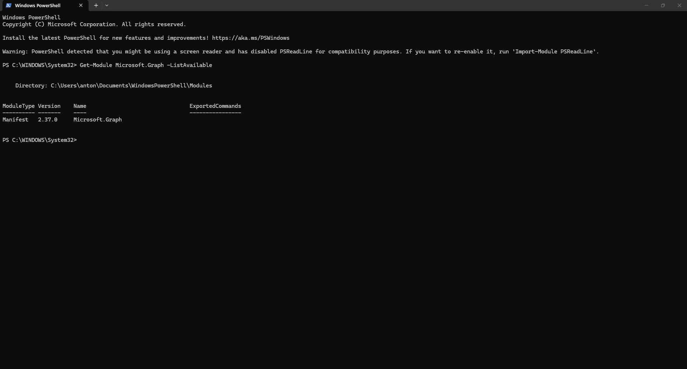
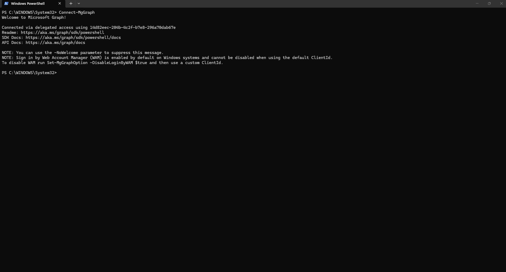
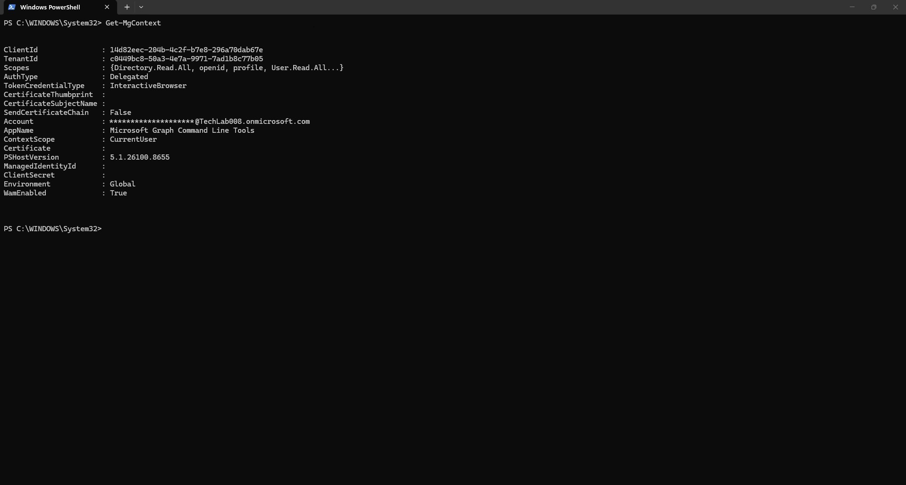
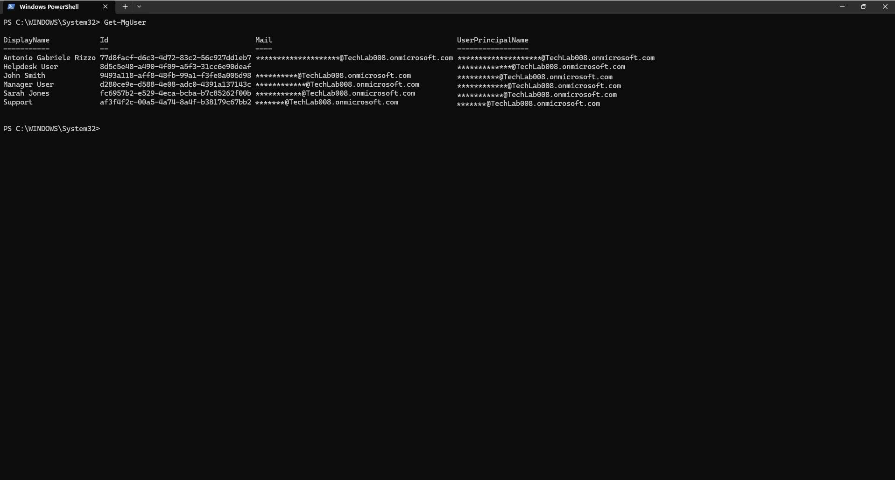
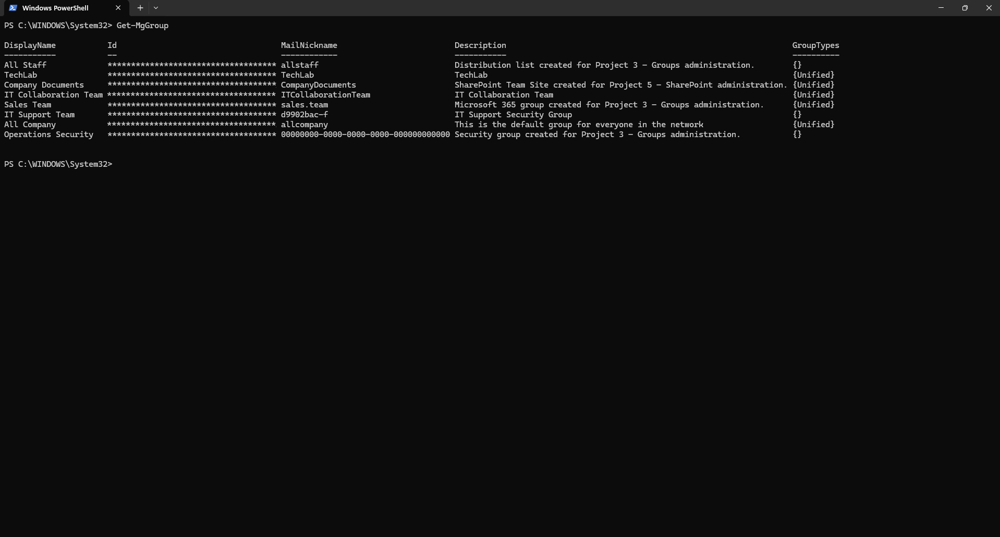
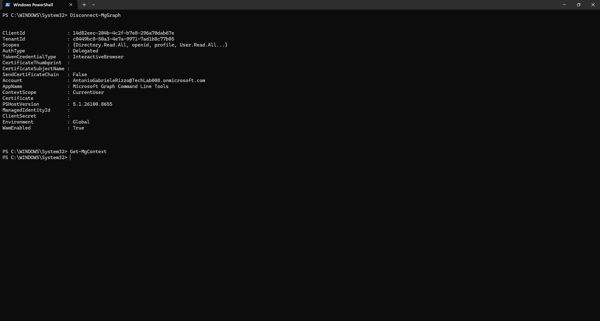

# 08 - Basic Microsoft Graph PowerShell

## Introduction

Microsoft Graph PowerShell is the modern command-line management interface for Microsoft cloud services. It provides administrators with direct access to Microsoft Graph APIs and enables management of Microsoft Entra ID, Microsoft 365, users, groups, and other cloud resources through PowerShell.

Microsoft Graph PowerShell replaces many legacy administration modules and is now the recommended approach for cloud administration and automation.

In this chapter, Microsoft Graph PowerShell was used to verify module installation, establish a connection to Microsoft Graph, review session information, retrieve users and groups, and safely disconnect administrative sessions.

---

## Objectives

After completing this chapter, you should be able to:

- Verify Microsoft Graph PowerShell installation
- Connect to Microsoft Graph
- Review active connection information
- Retrieve Microsoft Entra ID users
- Retrieve Microsoft Entra ID groups
- Understand Graph session management
- Disconnect Microsoft Graph sessions
- Understand modern Microsoft administration practices

---

## Prerequisites

- Microsoft Graph PowerShell installed
- PowerShell access
- Microsoft Entra ID tenant
- Administrative account
- Completed Chapters 01–07

---

# Understanding Microsoft Graph PowerShell

Microsoft Graph PowerShell provides a unified administrative interface for Microsoft cloud services.

Benefits include:

- Modern authentication support
- Secure administrative access
- Microsoft Graph API integration
- Cross-service administration
- Automation capabilities
- Reporting capabilities
- Future-proof cloud administration

Microsoft recommends Microsoft Graph PowerShell for many modern administrative scenarios.

---

# Verifying Microsoft Graph Installation

## Command

```powershell
Get-Module Microsoft.Graph -ListAvailable
```



The command confirms that the Microsoft Graph module is installed and available on the system.

Information displayed includes:

- Module type
- Module version
- Module name
- Available commands

In this lab environment, Microsoft.Graph version 2.37.0 was installed successfully.

---

# Connecting to Microsoft Graph

## Command

```powershell
Connect-MgGraph
```



The Connect-MgGraph cmdlet initiates authentication with Microsoft Graph.

After authentication, the session can access Microsoft Entra ID resources based on the permissions granted to the authenticated account.

This step is required before executing most Microsoft Graph PowerShell commands.

---

# Reviewing Connection Context

## Command

```powershell
Get-MgContext
```



The Get-MgContext cmdlet displays information about the active Microsoft Graph session.

Typical information includes:

- Tenant ID
- Account
- Environment
- Authentication scopes
- Client information

Reviewing the context allows administrators to verify that they are connected to the correct tenant and operating with the expected permissions.

---

# Retrieving User Information

## Command

```powershell
Get-MgUser
```



The Get-MgUser cmdlet retrieves user objects from Microsoft Entra ID.

Administrators can use this command to:

- Review user accounts
- Verify account creation
- Generate reports
- Support troubleshooting
- Perform identity administration tasks

Microsoft Graph provides significantly more flexibility than traditional graphical administration interfaces.

---

# Retrieving Group Information

## Command

```powershell
Get-MgGroup
```



The Get-MgGroup cmdlet retrieves group objects from Microsoft Entra ID.

This command can be used to:

- Review security groups
- Review Microsoft 365 groups
- Support access reviews
- Investigate permissions
- Assist with group administration

PowerShell-based administration enables efficient management of larger environments.

---

# Disconnecting Microsoft Graph

## Commands

```powershell
Disconnect-MgGraph
Get-MgContext
```



After administrative tasks have been completed, administrators should disconnect active Microsoft Graph sessions.

Benefits include:

- Reduced security exposure
- Improved session management
- Administrative best practices
- Clear separation between administrative tasks

Disconnecting confirms that no active Graph context remains in the PowerShell session.

---

# Administrative Use Cases

Microsoft Graph PowerShell can be used for many common administrative tasks.

### User Administration

- User reporting
- User management
- Account verification
- Identity administration

### Group Administration

- Group reviews
- Membership reporting
- Access management
- Security administration

### Automation

- Scheduled reporting
- Bulk administration
- Identity automation
- Operational efficiency

### Cloud Administration

- Microsoft Entra ID management
- Microsoft 365 administration
- Cross-service management
- API-driven administration

---

# Security Considerations

When using Microsoft Graph PowerShell:

- Use least-privilege permissions whenever possible.
- Review granted scopes before executing administrative actions.
- Disconnect sessions when administrative tasks are complete.
- Use administrative accounts responsibly.
- Protect PowerShell environments from unauthorised access.

Following these practices helps maintain a secure administrative environment.

---

# Key Learnings

This chapter demonstrated:

- Microsoft Graph module verification
- Microsoft Graph authentication
- Session context review
- User retrieval
- Group retrieval
- Session disconnection
- Modern cloud administration practices

---

# Skills Developed

By completing this chapter, the following skills were developed:

- Microsoft Graph Administration
- PowerShell Administration
- Identity Management
- User Administration
- Group Administration
- Cloud Administration
- Microsoft Entra Administration
- Technical Documentation

---

# Chapter Summary

In this chapter, Microsoft Graph PowerShell was used to connect to Microsoft Entra ID and retrieve directory information.

The following activities were completed:

- Verified Microsoft Graph installation
- Connected to Microsoft Graph
- Reviewed session context information
- Retrieved users
- Retrieved groups
- Disconnected the Graph session

Microsoft Graph PowerShell is an essential tool for modern Microsoft administrators and provides a foundation for automation, reporting, identity management, and cloud administration.
