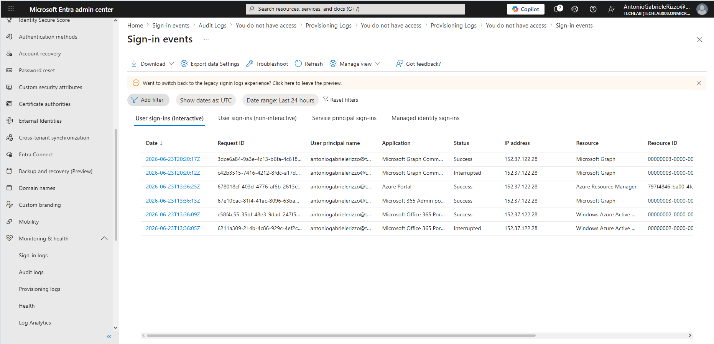
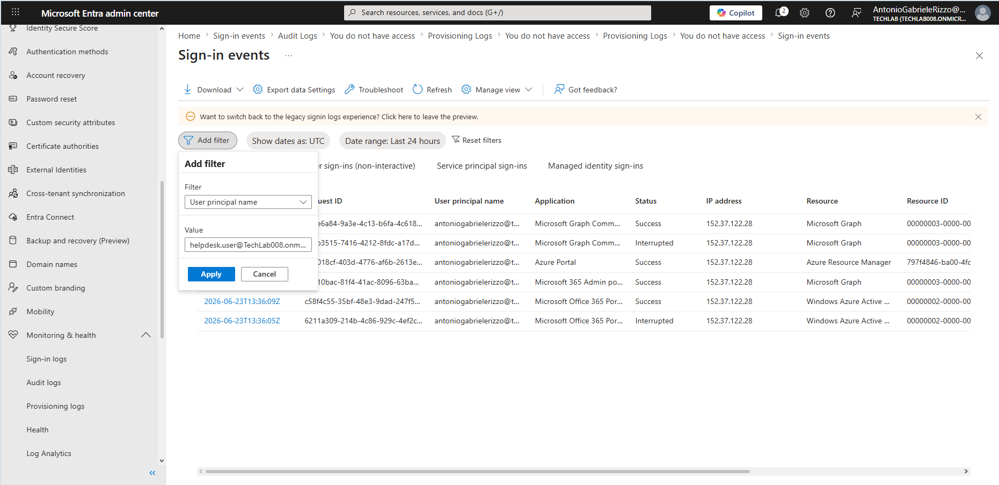
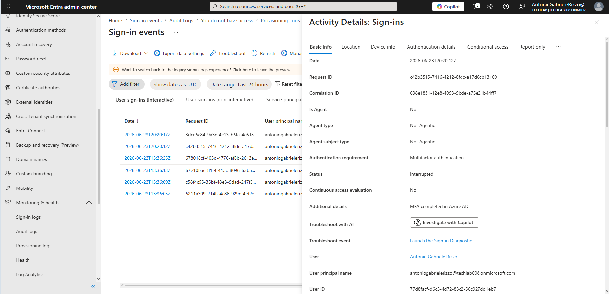
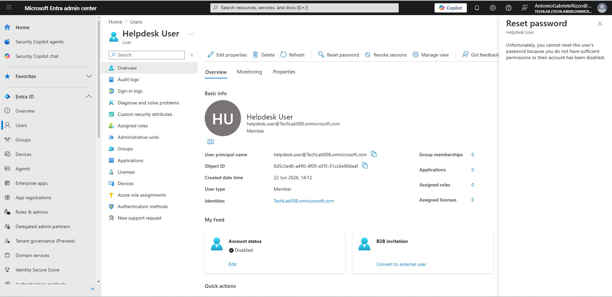
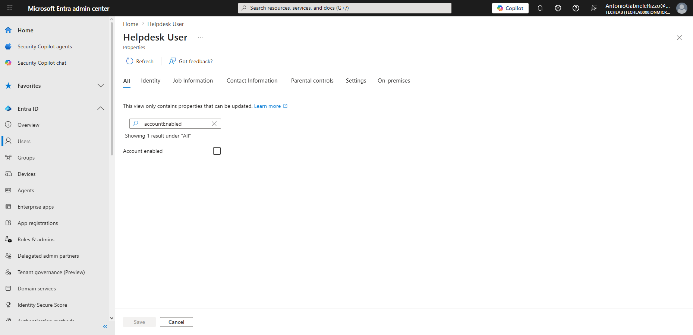
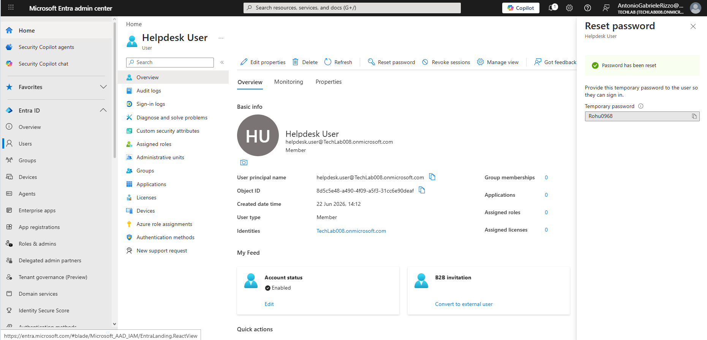

# 09 - Troubleshooting Scenarios

## Introduction

Troubleshooting is one of the most important responsibilities of identity administrators and Service Desk professionals. Microsoft Entra ID provides tools that help administrators investigate authentication issues, review account status, analyse sign-in activity, and resolve user access problems.

This chapter documents a practical troubleshooting workflow using Microsoft Entra ID. The investigation begins with Sign-in Logs, continues through event analysis, identifies an account issue, and concludes with successful remediation through account enablement and password reset.

---

## Objectives

After completing this chapter, you should be able to:

- Review Sign-in Logs
- Filter authentication activity
- Investigate sign-in events
- Identify account-related issues
- Verify account status
- Enable disabled user accounts
- Reset user passwords
- Apply structured troubleshooting methodology

---

## Prerequisites

- Microsoft Entra ID tenant
- Administrative account
- Test user account
- Completed Chapters 01–08

---

# Troubleshooting Methodology

A structured troubleshooting process helps administrators identify and resolve issues efficiently.

The workflow used in this chapter follows:

1. Identify the issue
2. Gather information
3. Review logs
4. Investigate user status
5. Apply corrective actions
6. Verify successful resolution

---

# Step 1 – Review Sign-in Activity

## Navigation

Monitoring & Health → Sign-in logs

Sign-in Logs provide visibility into authentication activity occurring within the tenant.

Administrators can review:

- Successful sign-ins
- Interrupted sign-ins
- Authentication requirements
- Application access attempts
- User activity

This information is often the starting point for troubleshooting authentication problems.

---

# Step 2 – Filter Sign-in Events

## Navigation

Sign-in logs → Add filter

Filtering allows administrators to narrow investigation results and focus on a specific user or authentication event.

Common filters include:

- User Principal Name
- Status
- Application
- Date range
- Location

Filtering significantly improves investigation efficiency.

---

# Step 3 – Investigate Sign-in Details

## Navigation

Sign-in logs → Select event

Detailed event information provides valuable troubleshooting data.

Information reviewed includes:

- Authentication status
- User account
- Application accessed
- Authentication requirement
- IP address
- Event timestamp

During troubleshooting, administrators use this information to identify potential authentication issues and determine the next investigative steps.

---

# Step 4 – Identify the Issue

## Scenario

A password reset attempt was performed for a user account that could not be accessed successfully.

The error message indicated that the account status required investigation before password recovery could be completed successfully.

This demonstrates the importance of validating account status before performing remediation actions.

---

# Step 5 – Verify and Enable the Account

## Navigation

Users → User Account → Properties

Reviewing account properties confirmed the account status.

Corrective action:

- Verify account configuration
- Enable the account if disabled
- Save the configuration

Account status validation is a common troubleshooting task performed by Service Desk and Identity Administrators.

---

# Step 6 – Verify Resolution

## Navigation

Users → Reset Password

After correcting the account status, the password reset operation completed successfully.

Successful remediation confirms:

- Account status is valid
- Administrative access is functioning correctly
- User recovery procedures can proceed

Verification is a critical final step in every troubleshooting process.

---

# Troubleshooting Best Practices

When investigating identity-related issues:

- Gather information before making changes.
- Review Sign-in Logs whenever authentication issues are reported.
- Verify account status before performing password resets.
- Apply the Principle of Least Privilege.
- Document actions taken during troubleshooting.
- Verify successful resolution after corrective actions.

Following a structured process reduces errors and improves support outcomes.

---

# Key Learnings

This chapter demonstrated:

- Sign-in Log investigation
- Event filtering
- Authentication analysis
- Account status verification
- Account enablement
- Password reset troubleshooting
- Issue remediation
- Resolution verification

---

# Skills Developed

By completing this chapter, the following skills were developed:

- Troubleshooting Methodology
- Incident Investigation
- Identity Administration
- Authentication Troubleshooting
- Service Desk Procedures
- Root Cause Analysis
- Microsoft Entra Administration
- Technical Documentation

---

# Chapter Summary

In this chapter, a practical Microsoft Entra ID troubleshooting workflow was performed.

The investigation began with Sign-in Logs, progressed through event analysis, identified an account-related issue, and concluded with successful remediation through account verification, account enablement, and password reset procedures.

These activities reflect common real-world support scenarios encountered by Service Desk Analysts, Identity Administrators, and Microsoft 365 administrators.
